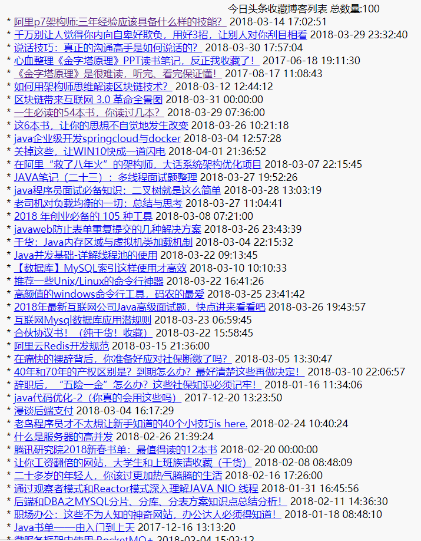

# java_spiderPro
###工程二维码  
  

###基本功能  
   
1.favorites模块  
"收藏不看系列",温故而知新,从开源中国,今日头条等第三方网站获取个人收藏并导出文章访问目录。  
  
  
已完成导出今日头条收藏博客列表.  

2.music模块  
音乐收藏爱好者,看着网易云收藏的音乐一片片的变灰，基本期望功能是吧歌单先导出来备份！只是导出来没有下载。  

###后续计划  
音乐歌单目录导出软件，网易云等各大音乐平台由于版权问题，间歇性的会让一些收藏的音乐无法播放,所以做了这个小软件，把常见的音乐网站的个人收藏的歌单导出备份，目前实现导出网易云音乐个人收藏的歌单,后面再不断兼容其他音乐网站的歌单导出功能吧。  
后续计划：  
1.模拟登陆直接导出，无需下载静态页面导出；     
2.跨音乐网站，把本地歌单文件导入其他音乐网站；  

###导出歌单示例:2018年三月最热新歌TOP50
 小半 (Live) - (原唱：陈粒) 周锐/郑锐彬/灵超/钱正昊  
 Firewalking (Live) 灵超/余明君/林超泽/李权哲/木子洋/林彦俊/陈立农  
 我怀念的 (Live) - (原唱：孙燕姿) 陈立农/李权哲/韩沐伯/尤长靖  
 最美的期待 周笔畅  
 爱了很久的朋友 - (电影《后来的我们》插曲) 田馥甄  
 慢慢喜欢你 莫文蔚  
 半句再见 孙燕姿  
 拥抱 徐秉龙  
 Strawberries & Cigarettes Troye Sivan  
 Change Charlie Puth/James Taylor  
 这样的你 - (综艺《送一百位女孩回家》主题曲) 金玟岐  
 初见初恋 - (电视剧《人生若如初相见》秦桑角色曲) 孙怡  
 谎人国 苏诗丁  
 柔软 房东的猫  
 探清水河 晓月老板  
 如常 房东的猫  
 花开 陈粒  
 Done For Me Charlie Puth/Kehlani  
 Everybody Hates Me The Chainsmokers  
 In My Blood Shawn Mendes  
 SORRY 艾福杰尼  
 最美不过是朝晖 花粥  
 Your Song Lady Gaga  
 菩提偈 - (《独孤天下》电视剧片尾曲) 刘惜君  
 羞答答的玫瑰静悄悄地开 胡夏  
 只想要你知道 鬼卞  
 小さな恋のうた - (TV动画《擅长捉弄的高木同学》第9-10集片尾曲 / TVアニメ「からかい上手の高木さん」第9・10話EDテーマ) 高橋李依  
 锁你锁心 - (电视剧《人生若如初相见》片尾曲) 孙伯纶  
 独一 房东的猫  
 长河 大傻DamnShine/GAI爷/布瑞吉Bridge  
 Way Back Vicetone/Cozi Zuehlsdorff  
 Call Out My Name The Weeknd  
 母老虎 Ty./谢帝  
 Lost In Japan Shawn Mendes  
 向爱出发 Tizzy T  
 被拥抱的荒岛 曹方  
 东风第一枝 玄觞  
 This Is Me (Alan Walker Relift) [From "The Greatest Showman"] Keala Settle/The Greatest Showman Ensemble/Alan Walker  
 奥特曼（Ultraman） 余佳运  
 トリカゴ - (TV动画《DARLING in the FRANXX》ED1) XX:me  
 Flames David Guetta/Sia  
 最想去的地方 炎亚纶  
 无法直视 陈雪凝  
 La Cintura Álvaro Soler  
 小可爱与小领带 G.G(张思源）  
 水形物语 - (电影《水形物语》同名推广曲) 周深  
 Pray Sam Smith/Logic  
 十八岁给我一个姑娘 - (《十八岁给我一个姑娘》同名主题曲) 好妹妹乐队  
 Chasing Fire Lauv  
 我得先走 宁桓宇  

